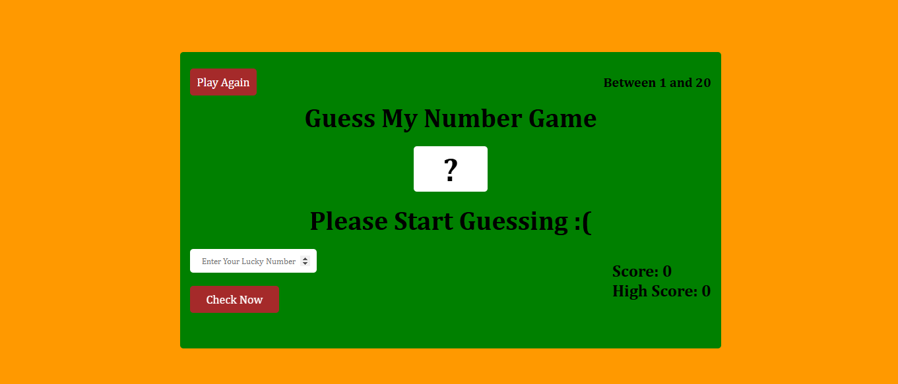
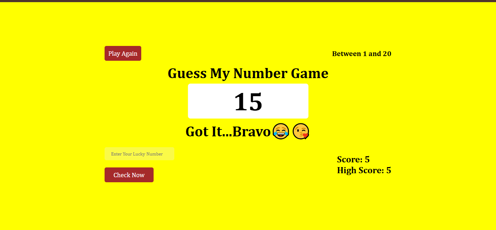
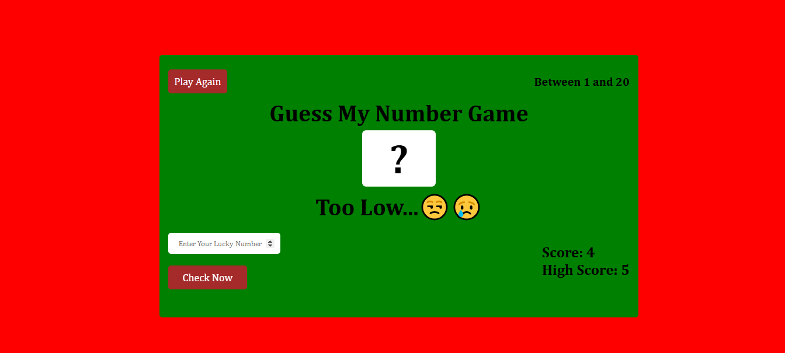
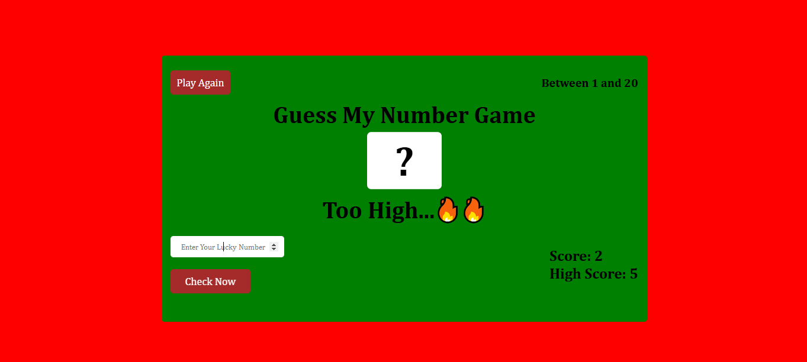

# GUESS MY NUMBER APP

## 🌟 About the Project  

Guess My Number is a fun and interactive number guessing game built with JavaScript. The goal is simple: the player tries to guess a randomly generated number within a given range. With every guess, they receive hints to guide them closer to the correct answer.

✨ Features
Random number generation within a specified range
User input validation and feedback (Too high, Too low, or Correct)
Score tracking for performance evaluation
Play-again functionality to restart the game
Responsive and visually appealing UI

🚀 Technologies Used
HTML
CSS
JavaScript

🔧 How to Play
The app generates a random number.
Enter your guess in the input field.
Get feedback if your guess is too high, too low, or correct.
Keep guessing until you find the correct number.
Click "Play Again" to start a new round!

📌 Future Improvements (Optional)
Difficulty levels (Easy, Medium, Hard)
Timer and leaderboard for competitive play
Sound effects and animations for better user experience

## 🚀 Live Demo  
🔗 [Visit the Website](https://mini-quiz-app-eta.vercel.app/)

